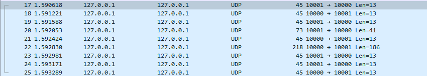
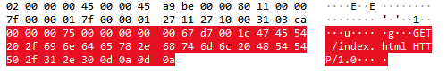
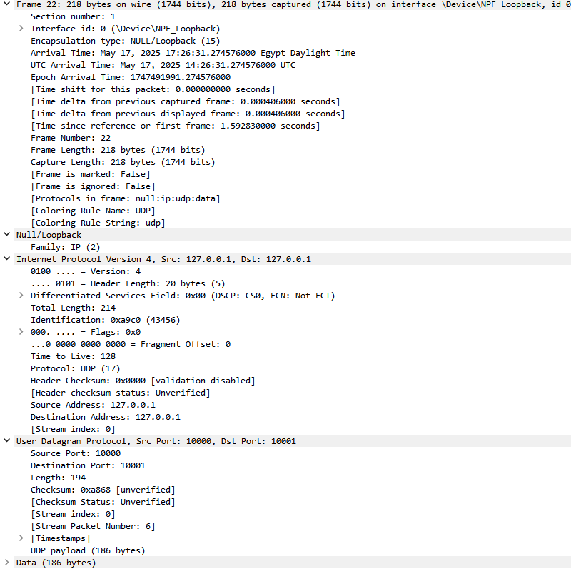
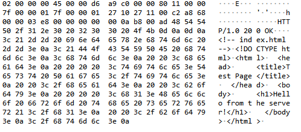

# Reliable UDP HTTP Server Project Documentation

## Prepared By : Gehad Khaled Elsamadisy

## Table of Contents

1. [Introduction](#introduction)
2. [Quick Start](#quick-start)
3. [Project Overview](#project-overview)
4. [Technical Details](#technical-details)
5. [Implementation](#implementation)
6. [Testing](#testing)
7. [Analysis](#analysis)
8. [Future Work](#future-work)
9. [References](#references)

## Introduction

This project implements a reliable HTTP server using UDP as the underlying transport protocol. It includes custom reliability mechanisms to handle packet loss, corruption, and out-of-order delivery, simulating TCP-like behavior over UDP.

### Key Features

- Reliable data transfer over UDP
- HTTP 1.0 server implementation
- Packet loss and corruption simulation
- Stop-and-wait protocol
- Three-way handshake
- Browser-compatible web interface

## Quick Start

### Requirements

- Python 3.6+
- Wireshark (for traffic analysis)
- Administrator/root privileges (for port 80)

### Installation

1. Clone the repository:

```bash
git clone <repository-url>
cd reliable-udp-http
```

2. Install dependencies:

```bash
pip install -r requirements.txt
```

### Running the Server

1. Start the server with administrator privileges:

```bash
sudo httpserver.py
```

2. Access the server:

```
http://localhost
```

### Testing

1. **Clean Transfer Test**:

```bash
python testclean.py
```

2. **Packet Loss Test**:

```bash
python testloss.py
```

3. **Packet Corruption Test**:

```bash
python testcorrupt.py
```

4. **Combined Test**:

```bash
python testlossandcorrupt.py
```

### Wireshark Analysis

1. Open Wireshark
2. Start a new capture
3. Apply filter: `udp port 80`
4. Access the server through your browser
5. Analyze the captured traffic

## Project Overview

### Project Goals

- Implement reliable data transfer over UDP
- Create a functional HTTP server using the reliable UDP implementation
- Handle packet loss and corruption gracefully
- Provide a working web interface accessible through standard browsers

### Project Structure

```
project/
├── rudp.py           # Reliable UDP implementation
├── httpserver.py     # HTTP server implementation
├── packet.py         # Packet format and utilities
├── browser_server.py # Main server script
├── test*.py         # Test scripts
└── index.html          # Test Page
```

## Technical Details

### Protocol Design

#### Packet Format

```
+----------------+----------------+--------+----------------+--------+
| Sequence Number| Ack Number     | Flags  | Payload Length | Payload|
| (4 bytes)      | (4 bytes)      |(1 byte)| (2 bytes)      | (var)  |
+----------------+----------------+--------+----------------+--------+
```

#### Protocol Flags

- SYN (0x1): Synchronize sequence numbers
- ACK (0x2): Acknowledge received data
- FIN (0x4): Finish/close connection

#### Reliability Mechanisms

1. **Sequence Numbers**: Track packet order
2. **Acknowledgments**: Confirm packet receipt
3. **Checksums**: Detect corrupted packets
4. **Timeouts**: Handle lost packets
5. **Retransmission**: Resend lost packets
6. **Stop-and-Wait**: Ensure reliable delivery

## Implementation

### ReliableUDP Class

The core of the implementation is the `ReliableUDP` class, which provides:

- Connection management (connect, accept, disconnect)
- Reliable data transfer (send_stop_and_wait, receive_stop_and_wait)
- Error handling and recovery
- Packet loss and corruption simulation

Key methods:

```python
def connect(self):
    # Implements three-way handshake
    # 1. Send SYN
    # 2. Wait for SYN-ACK
    # 3. Send ACK

def send_stop_and_wait(self, payload: bytes):
    # Implements stop-and-wait protocol
    # 1. Send packet
    # 2. Wait for ACK
    # 3. Retransmit on timeout
```

### HTTPServer Class

The HTTP server implementation:

- Handles HTTP 1.0 requests
- Supports GET and POST methods
- Serves static files
- Provides proper HTTP responses

Example HTTP response:

```http
HTTP/1.0 200 OK
Content-Type: text/html
Content-Length: 1234
Connection: close

<html>...</html>
```

## Testing

### Test Scenarios

1. **Clean Transfer**

   - No packet loss or corruption
   - Verifies basic functionality

   Here is the test for the clean transfer:

   _From the Client Terminal_
   

   <br>

   <br>

   _From the Server Terminal_
   

2. **Packet Loss**

   - 10% packet loss probability
   - Tests retransmission mechanism

   _Here is the test for packet loss:_

_From the Client Terminal_

<br>

   <br>
   
   _From the Server Terminal:_


3. **Packet Corruption**

   - 10% corruption probability
   - Tests error detection and recovery

   _Here is the test for packet corruption:_

_From the Client Terminal:_

<br>
<br>

_From the Server Terminal_


4. **Combined Tests**
   - Both loss and corruption
   - Tests system under multiple failure conditions
     Here is the test for combined loss and corruption:

_From the Client Terminal:_

<br>
<br>

_From the Server Terminal_


### Performance Metrics

- Connection establishment time
- Data transfer reliability
- Error recovery effectiveness
- Throughput under various conditions

## Analysis

### Wireshark Analysis

#### Connection Setup and Data Transfer


_Figure 1: Initial connection setup showing three-way handshake_

The screenshot shows the three-way handshake process in the first 3 packets:

1. Client sends SYN packet
2. Server responds with SYN-ACK
3. Client acknowledges with ACK

### Data Transfer Analysis

Notice Here the 4th packet content, the 4th packet is the first packet after the 3 way handshake which contains the payload

_Figure 2: First data transfer sequence_

also here is the full details of the 4th packet

The packet structure shows:

- Sequence number field
- Acknowledgment number field
- Flags (SYN, ACK, FIN)
- Payload length
- Actual payload data
- Checksum for error detection

Here is the 6th packet which contains the requested HTML Page

